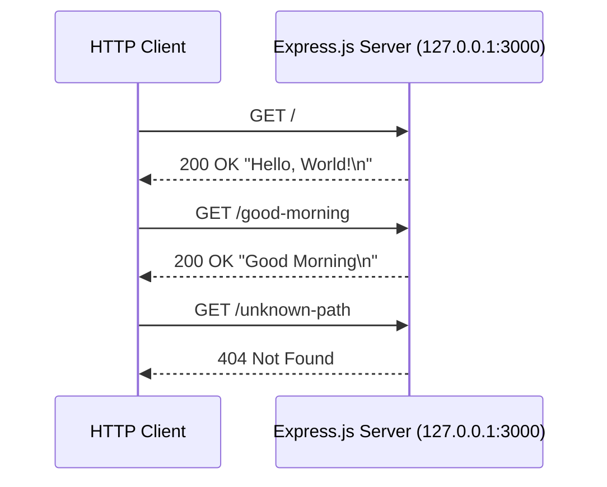
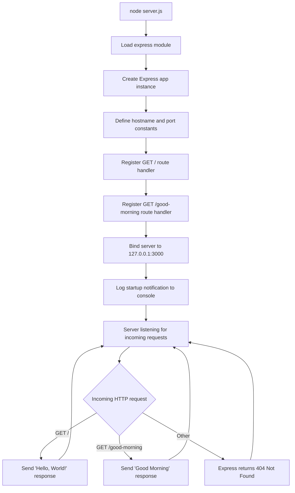

# hao-backprop-test

[](https://nodejs.org/)
[](https://www.npmjs.com/)
[](https://expressjs.com/)
[](https://opensource.org/licenses/MIT)

A minimal Node.js HTTP server built with Express.js, serving a "Hello, World!" response and a "Good Morning" response on separate endpoints. Used as a test fixture for Backprop integration.

---

## Table of Contents

- [About](#about)
- [Project Structure](#project-structure)
- [Prerequisites](#prerequisites)
- [Installation](#installation)
- [Usage](#usage)
- [API Reference](#api-reference)
- [Deployment Guide](#deployment-guide)
- [Troubleshooting](#troubleshooting)
- [Code Overview](#code-overview)
- [License](#license)

---

## About

**hao-backprop-test** is a minimal Node.js HTTP server built with [Express.js](https://expressjs.com/) designed as a test fixture for Backprop integration. It exposes two endpoints:

- **`GET /`** — Returns a static "Hello, World!" greeting.
- **`GET /good-morning`** — Returns a static "Good Morning" greeting.

The project uses Express.js as its sole runtime dependency, keeping the footprint small and the codebase easy to understand.

| Field       | Value                    |
|-------------|--------------------------|
| Package     | `hello_world`            |
| Version     | `1.0.0`                  |
| Author      | `hxu`                    |
| License     | MIT                      |
| Description | Hello world in Node.js   |
| Framework   | Express.js 5.x          |

---

## Project Structure

The repository is intentionally minimal with no subdirectories (no `src/`, `lib/`, `docs/`, or `test/` folders):

```text
hao-backprop-test/
├── server.js          # Express.js HTTP server (sole runtime component)
├── package.json       # npm package manifest (Express.js dependency)
├── package-lock.json  # npm lockfile (lockfileVersion 3)
├── node_modules/      # Installed dependencies (generated by npm install)
└── README.md          # Project documentation (this file)
```

> **Note:** The `"main"` field in `package.json` is set to `"index.js"`, which does not exist in the repository. The actual entry point is `server.js`. This discrepancy does not affect server operation since the server is started directly via `node server.js` rather than through the `main` field.

---

## Prerequisites

| Requirement | Minimum                                  | Recommended                              |
|-------------|------------------------------------------|------------------------------------------|
| Node.js     | Any version with CommonJS support        | Node.js 20.x LTS                        |
| npm         | 7+ (required for lockfileVersion 3)      | 10.x+ (bundled with Node.js 20)         |
| Port 3000   | Must be available                        | Must be available                        |

**Why npm 7+?** The `package-lock.json` file uses `lockfileVersion: 3`, which is only supported by npm 7 and later. Earlier versions of npm will either fail to parse the lockfile or silently downgrade it.

Download Node.js (which includes npm) from the official website: [https://nodejs.org/](https://nodejs.org/)

---

## Installation

```bash
git clone <repository-url>
cd hao-backprop-test
npm install
```

> **Note:** `npm install` will download the Express.js framework and its transitive dependencies into the `node_modules` directory.

---

## Usage

### Start the Server

```bash
node server.js
```

**Expected console output:**

```text
Server running at http://127.0.0.1:3000/
```

### Verify the Endpoints

Open a new terminal and test each endpoint:

**Hello World endpoint:**

```bash
curl http://127.0.0.1:3000/
```

**Expected output:**

```text
Hello, World!
```

**Good Morning endpoint:**

```bash
curl http://127.0.0.1:3000/good-morning
```

**Expected output:**

```text
Good Morning
```

### Stop the Server

Press `Ctrl+C` in the terminal where the server is running.

---

## API Reference

### Endpoints

#### `GET /` — Hello World

| Property              | Value                          |
|-----------------------|--------------------------------|
| URL                   | `http://127.0.0.1:3000/`      |
| Method                | `GET`                          |
| Response Status       | `200 OK`                       |
| Response Content-Type | `text/plain; charset=utf-8`    |
| Response Body         | `Hello, World!\n`              |

**Example:**

```bash
curl -v http://127.0.0.1:3000/
```

**Expected output (key lines):**

```text
> GET / HTTP/1.1
> Host: 127.0.0.1:3000
>
< HTTP/1.1 200 OK
< Content-Type: text/plain; charset=utf-8
<
Hello, World!
```

#### `GET /good-morning` — Good Morning

| Property              | Value                               |
|-----------------------|-------------------------------------|
| URL                   | `http://127.0.0.1:3000/good-morning`|
| Method                | `GET`                               |
| Response Status       | `200 OK`                            |
| Response Content-Type | `text/plain; charset=utf-8`         |
| Response Body         | `Good Morning\n`                    |

**Example:**

```bash
curl -v http://127.0.0.1:3000/good-morning
```

**Expected output (key lines):**

```text
> GET /good-morning HTTP/1.1
> Host: 127.0.0.1:3000
>
< HTTP/1.1 200 OK
< Content-Type: text/plain; charset=utf-8
<
Good Morning
```

### Unmatched Routes

Requests to paths not defined above (e.g., `/foo`, `/bar`) will receive Express.js's default 404 response.

### Request/Response Flow



---

## Deployment Guide

### Local Execution

Start the server in the foreground:

```bash
node server.js
```

The server will bind to `127.0.0.1:3000` and begin accepting HTTP requests. The process runs in the foreground and can be stopped with `Ctrl+C`.

### Production Considerations

The server binds to `127.0.0.1` (localhost only), which means it is **not accessible from external machines**. This is by design for a test fixture. To allow external access, the `hostname` constant in `server.js` would need to be changed to `'0.0.0.0'` — however, this modification is outside the scope of this project.

### Process Management

For long-running deployments, consider using a process manager:

**PM2:**

```bash
npx pm2 start server.js
npx pm2 status
```

**systemd (Linux):**

Create a systemd service unit file to manage the server as a system service. Refer to the [systemd documentation](https://www.freedesktop.org/software/systemd/man/systemd.service.html) for details.

> **Note:** Process managers are informational suggestions, not project requirements.

### Port Configuration

Port `3000` is hardcoded in `server.js`. To change the port:

1. Open `server.js`
2. Modify the `port` constant to the desired port number
3. Restart the server

There is no environment variable support for port configuration.

### Shutdown Procedures

| Scenario              | Command                    |
|-----------------------|----------------------------|
| Foreground process    | `Ctrl+C`                   |
| Background process    | `kill <PID>` or `kill %1`  |
| PM2 managed process   | `npx pm2 stop server`      |

---

## Troubleshooting

### ERR-001: Port Already in Use

**Symptom:**

```text
Error: listen EADDRINUSE: address already in use 127.0.0.1:3000
```

**Cause:** Another process is already using port 3000.

**Resolution:**

Find and stop the conflicting process:

```bash
# macOS / Linux
lsof -i :3000
kill <PID>

# Windows
netstat -ano | findstr :3000
taskkill /PID <PID> /F
```

Alternatively, change the `port` constant in `server.js` to an available port.

---

### ERR-002: Node.js Not Installed

**Symptom:**

```text
command not found: node
```

or on Windows:

```text
'node' is not recognized as an internal or external command
```

**Cause:** Node.js is not installed or is not in the system PATH.

**Resolution:** Install Node.js from [https://nodejs.org/](https://nodejs.org/) and ensure it is added to your PATH.

---

### ERR-003: Permission Denied

**Symptom:**

```text
Error: listen EACCES: permission denied 127.0.0.1:3000
```

**Cause:** Insufficient permissions to bind to the specified port.

**Resolution:** Use a port number above 1024 (which does not require elevated privileges), or run the server with elevated permissions (`sudo` on macOS/Linux). Port 3000 should not normally require elevated privileges, so this error typically indicates a system policy restriction.

---

### ERR-004: Module Not Found

**Symptom:**

```text
Error: Cannot find module 'express'
```

**Cause:** Dependencies have not been installed, or `node_modules` is missing.

**Resolution:** Run the installation step from the project root:

```bash
cd /path/to/hao-backprop-test
npm install
node server.js
```

---

### ERR-005: Connection Refused

**Symptom:**

```text
curl: (7) Failed to connect to 127.0.0.1 port 3000: Connection refused
```

**Cause:** The server is not running.

**Resolution:** Start the server before making requests:

```bash
node server.js
```

Then, in a separate terminal:

```bash
curl http://127.0.0.1:3000/
```

---

## Code Overview

The server is a **single-file Express.js application** with two defined routes. It follows a synchronous startup sequence with asynchronous request handling. Both route handlers are **stateless** — every request to a given endpoint receives the identical response.

### Architecture Summary

| Aspect              | Detail                                                      |
|---------------------|-------------------------------------------------------------|
| Runtime             | Node.js with CommonJS modules (`require()`)                 |
| Framework           | Express.js 5.x                                             |
| Dependencies        | Express.js (sole runtime dependency)                        |
| Startup             | Synchronous (module load → constants → route registration → bind) |
| Request Handling    | Asynchronous (event-driven via Express route handlers)      |
| State               | Stateless — no data persistence between requests            |
| Endpoints           | 2 (`GET /` and `GET /good-morning`)                         |

### Server Lifecycle



### Source Code Walkthrough

The following references correspond to the JSDoc-annotated `server.js`:

- **Line 15** — `const express = require('express')`: Imports the Express.js framework, which provides routing and HTTP server abstraction.
- **Line 22** — `const app = express()`: Creates the Express application instance that manages routes and middleware.
- **Lines 31, 40** — `const hostname` / `const port`: Defines the server binding address (`127.0.0.1`) and listening port (`3000`) as named constants.
- **Lines 55–59** — `app.get('/', ...)`: Registers the root route handler that responds with `"Hello, World!\n"`.
- **Lines 74–77** — `app.get('/good-morning', ...)`: Registers the `/good-morning` route handler that responds with `"Good Morning\n"`.
- **Lines 88–91** — `app.listen(port, hostname, ...)`: Binds the server to the specified hostname and port, then logs a startup notification.

---

## License

This project is licensed under the **MIT License**.

**Author:** hxu

See `package.json` for license metadata. No standalone `LICENSE` file exists in this repository.
