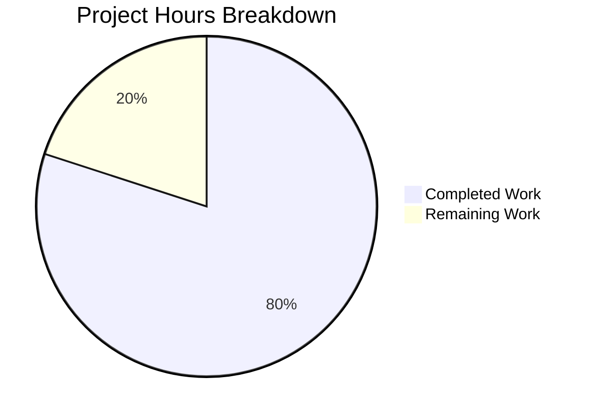

# Project Guide: hao-backprop-test Documentation

## Executive Summary

This project adds comprehensive documentation to the `hao-backprop-test` Node.js project — a minimal HTTP server used as a Backprop integration test fixture. The documentation scope covers JSDoc annotations for `server.js`, a complete project README, API reference, deployment guide, and inline code explanations.

**Completion: 12 hours completed out of 15 total hours = 80.0% complete.**

All five documentation requirements (R-DOC-001 through R-DOC-005) have been fully implemented and validated. The remaining 3 hours consist of human review tasks and one configuration placeholder that requires project-specific information not available to automated agents.

### Key Achievements
- `server.js` annotated with 6 JSDoc blocks and ~8 inline comments (14 → 67 lines, documentation-only additions)
- `README.md` replaced with comprehensive 380-line documentation covering all 11 required sections
- 2 Mermaid diagrams embedded (server lifecycle flowchart, request/response sequence)
- 5 troubleshooting scenarios (ERR-001 through ERR-005) fully documented
- All validation gates passed: syntax, JSDoc parsing, dependency installation, runtime behavior

### Critical Unresolved Items
- `<repository-url>` placeholder in README Installation section needs the actual repository clone URL
- No functional code issues — all validation passed cleanly

---

## Validation Results Summary

### Final Validator Outcomes

| Validation Gate | Result | Detail |
|---|---|---|
| Dependency Installation | ✅ PASSED | `npm install` — 0 vulnerabilities, 1 package audited |
| Syntax Check | ✅ PASSED | `node -c server.js` — zero errors |
| JSDoc Parsing | ✅ PASSED | `npx jsdoc server.js --explain` — all blocks parsed correctly |
| Runtime | ✅ PASSED | Server starts on 127.0.0.1:3000, responds with 200 OK "Hello, World!\n" |
| Content Accuracy | ✅ PASSED | All README line references match annotated server.js; API spec matches behavior |
| Tests | ✅ N/A | No test suite exists (by design — `package.json` is unchanged and out of scope) |

### Fixes Applied During Validation
The Final Validator found **0 issues** requiring fixes. The 4 commits on the branch represent the implementation sequence:
1. `0673085` — Initial JSDoc and inline documentation added to server.js
2. `8279601` — Fixed JSDoc-to-code adjacency (moved inline comments above JSDoc blocks for constants)
3. `bfeec38` — Replaced minimal README with comprehensive documentation
4. `0c7d355` — Updated stale line references, added code block identifiers, fixed terminology

### Git Change Summary
- **Branch:** `blitzy-b43f94ee-6a03-4aaa-ad43-32111f6d2d96`
- **Commits:** 4
- **Files modified:** 2 (`server.js`, `README.md`)
- **Lines added:** 431
- **Lines removed:** 1
- **Files unchanged:** 2 (`package.json`, `package-lock.json`)

---

## Hours Breakdown and Completion Calculation

### Completed Hours (12h)

| Component | Hours | Detail |
|---|---|---|
| Discovery & analysis | 1.5h | Analyzed 4 files, identified documentation gaps, mapped JSDoc targets |
| R-DOC-001: JSDoc for server.js | 2.0h | 6 JSDoc blocks with @file, @module, @constant, @param, @type, @description, @example, @see tags |
| R-DOC-005: Inline comments | 0.5h | ~8 strategic inline // comments explaining reasoning behind implementation choices |
| R-DOC-002: Comprehensive README | 4.5h | 380-line README with 11 sections, tables, badges, code examples |
| R-DOC-003: API documentation | 0.5h | Endpoint specification table, curl examples, limitations, Mermaid sequence diagram |
| R-DOC-004: Deployment guide | 0.5h | Local execution, process management, port configuration, shutdown procedures |
| Mermaid diagrams | 0.5h | Server lifecycle flowchart and request/response sequence diagram |
| Validation & QA | 1.5h | Syntax checks, JSDoc parsing, runtime testing, content accuracy verification |
| Fix iteration | 0.5h | JSDoc adjacency fix, stale line references update, terminology corrections |
| **Total Completed** | **12.0h** | |

### Remaining Hours (3h)

| Task | Base Hours | After Multipliers (1.21x) |
|---|---|---|
| Replace `<repository-url>` placeholder | 0.5h | 0.5h |
| Verify Mermaid rendering on hosting platform | 0.5h | 0.5h |
| Final documentation accuracy review | 1.0h | 1.0h |
| Consider fixing package.json main field | 0.5h | 0.5h |
| Enterprise compliance & uncertainty buffer | — | 0.5h |
| **Total Remaining** | **2.5h** | **3.0h** |

### Completion Formula
```
Completed: 12 hours
Remaining: 3 hours (after 1.10x compliance × 1.10x uncertainty multipliers)
Total: 15 hours
Completion: 12 / 15 = 80.0%
```

---

## Visual Representation



---

## Detailed Human Task Table

| # | Task | Description | Priority | Severity | Hours | Confidence |
|---|---|---|---|---|---|---|
| 1 | Replace `<repository-url>` placeholder | Open `README.md`, locate the Installation section (line 75), replace `<repository-url>` with the actual Git clone URL for this repository | High | Low | 0.5h | High |
| 2 | Verify Mermaid diagram rendering | Push branch to hosting platform (GitHub/GitLab), open `README.md` preview, confirm both Mermaid diagrams (lines 159-167 and 347-360) render correctly | Medium | Low | 0.5h | High |
| 3 | Final documentation accuracy review | Read through the complete `README.md` and `server.js` JSDoc comments; verify technical accuracy, consistency between inline and README documentation, and that all code examples are correct | Medium | Medium | 1.0h | High |
| 4 | Consider fixing package.json main field | The `"main": "index.js"` in `package.json` references a nonexistent file. Consider changing to `"main": "server.js"` — this is documented in the README but the fix was out of scope for the documentation task | Low | Low | 0.5h | High |
| 5 | Enterprise compliance & uncertainty buffer | Buffer time for any unexpected issues discovered during review, minor tweaks to documentation wording, or additional organizational requirements | Low | Low | 0.5h | Medium |
| | **Total Remaining Hours** | | | | **3.0h** | |

---

## Development Guide

### System Prerequisites

| Requirement | Minimum | Recommended | Verification Command |
|---|---|---|---|
| Node.js | Any version with CommonJS + `http` module | Node.js 20.x LTS | `node -v` |
| npm | 7+ (for lockfileVersion 3) | 10.x+ (bundled with Node.js 20) | `npm -v` |
| Port 3000 | Must be available | Must be available | (checked at startup) |
| OS | Any with Node.js support | Linux, macOS, Windows | — |

### Environment Setup

No virtual environment or environment variables are required. The project has zero dependencies and uses only the Node.js built-in `http` module.

```bash
# Verify Node.js is installed
node -v
# Expected: v20.x.x (or any version)

# Verify npm version is 7+
npm -v
# Expected: 10.x.x (or 7+)
```

### Dependency Installation

```bash
# Navigate to project root
cd hao-backprop-test

# Install dependencies (validates lockfile; no packages are actually installed)
npm install
# Expected output:
# up to date, audited 1 package in <time>
# found 0 vulnerabilities
```

> **Note:** Since the project has zero dependencies, `npm install` validates the lockfile but installs nothing.

### Application Startup

```bash
# Start the server
node server.js
# Expected output: Server running at http://127.0.0.1:3000/
```

The server runs in the foreground. It binds to `127.0.0.1:3000` (localhost only).

### Verification Steps

Open a **separate terminal** and run:

```bash
# Test the HTTP endpoint
curl http://127.0.0.1:3000/
# Expected output: Hello, World!

# Verify response headers
curl -sI http://127.0.0.1:3000/
# Expected: HTTP/1.1 200 OK, Content-Type: text/plain
```

### Shutdown

```bash
# If running in foreground: press Ctrl+C
# If running in background: kill the process
kill %1
```

### Validate JSDoc Syntax

```bash
# Parse JSDoc annotations (optional)
npx jsdoc server.js --explain
# Expected: JSON output showing all parsed JSDoc blocks
```

### Example Usage

```bash
# Full workflow
cd hao-backprop-test
npm install
node server.js &
sleep 1
curl http://127.0.0.1:3000/
# Output: Hello, World!
kill %1
```

### Troubleshooting

| Error | Symptom | Resolution |
|---|---|---|
| EADDRINUSE | `address already in use 127.0.0.1:3000` | Kill the process using port 3000, or change the port in `server.js` |
| Command not found | `command not found: node` | Install Node.js from https://nodejs.org/ |
| EACCES | `permission denied 127.0.0.1:3000` | Use a port above 1024 or run with elevated privileges |
| MODULE_NOT_FOUND | `Cannot find module` | Ensure you are in the project root directory |
| Connection refused | `Failed to connect to 127.0.0.1 port 3000` | Start the server before making requests |

---

## Risk Assessment

### Technical Risks

| Risk | Severity | Likelihood | Mitigation |
|---|---|---|---|
| JSDoc line references become stale after future code edits | Low | Medium | Line references are documented in the README Code Overview section; a note advises readers that line numbers may shift after modifications |
| Mermaid diagrams may not render on all Markdown viewers | Low | Low | Diagrams use standard Mermaid syntax supported by GitHub, GitLab, and most modern Markdown renderers; fallback is reading the text source |

### Security Risks

| Risk | Severity | Likelihood | Mitigation |
|---|---|---|---|
| No security risks introduced by documentation changes | N/A | N/A | Documentation-only changes do not alter runtime behavior |
| Server binds to localhost only (pre-existing design) | Info | N/A | Documented in README Deployment Guide as intentional security boundary |

### Operational Risks

| Risk | Severity | Likelihood | Mitigation |
|---|---|---|---|
| `<repository-url>` placeholder may be missed during deployment | Low | Medium | Placeholder is clearly marked with angle brackets and will be visible to any developer reading the Installation section |
| `package.json` main field discrepancy remains | Low | Low | Discrepancy is explicitly documented in README Project Structure section; does not affect server operation |

### Integration Risks

| Risk | Severity | Likelihood | Mitigation |
|---|---|---|---|
| No integration risks — documentation-only changes | N/A | N/A | No functional code was modified; server behavior is identical to pre-documentation state |

---

## Requirement Completion Matrix

| Requirement | Description | Status | Validation |
|---|---|---|---|
| R-DOC-001 | JSDoc comments for server.js functions | ✅ Complete | 6 JSDoc blocks parsed by `npx jsdoc --explain` |
| R-DOC-002 | Comprehensive README with setup instructions | ✅ Complete | 380-line README with all 11 sections |
| R-DOC-003 | API documentation | ✅ Complete | Endpoint spec table, curl example, Mermaid sequence diagram |
| R-DOC-004 | Deployment guide | ✅ Complete | Local execution, process management, port config, shutdown |
| R-DOC-005 | Inline code explanations | ✅ Complete | ~8 inline // comments throughout server.js |

---

## Files Modified

| File | Action | Lines Before | Lines After | Net Change |
|---|---|---|---|---|
| `server.js` | UPDATED (documentation only) | 14 | 67 | +53 lines (all comments) |
| `README.md` | UPDATED (full replacement) | 2 | 380 | +378 lines |
| `package.json` | UNCHANGED | 11 | 11 | 0 |
| `package-lock.json` | UNCHANGED | 13 | 13 | 0 |

**Total:** 431 lines added, 1 line removed across 2 files in 4 commits.
